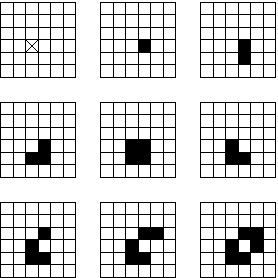
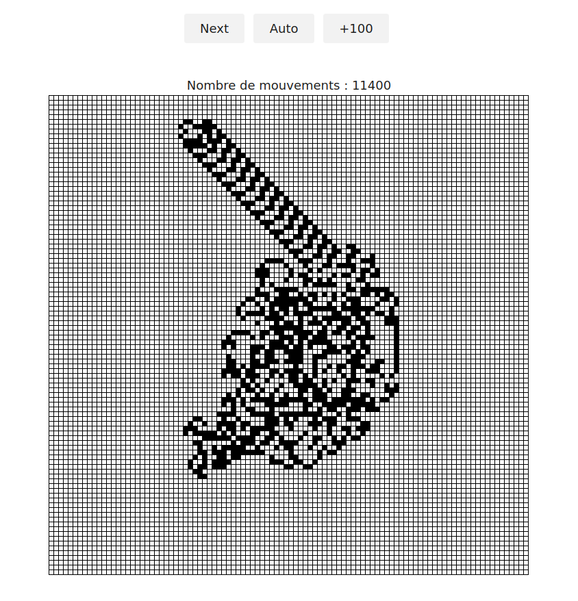
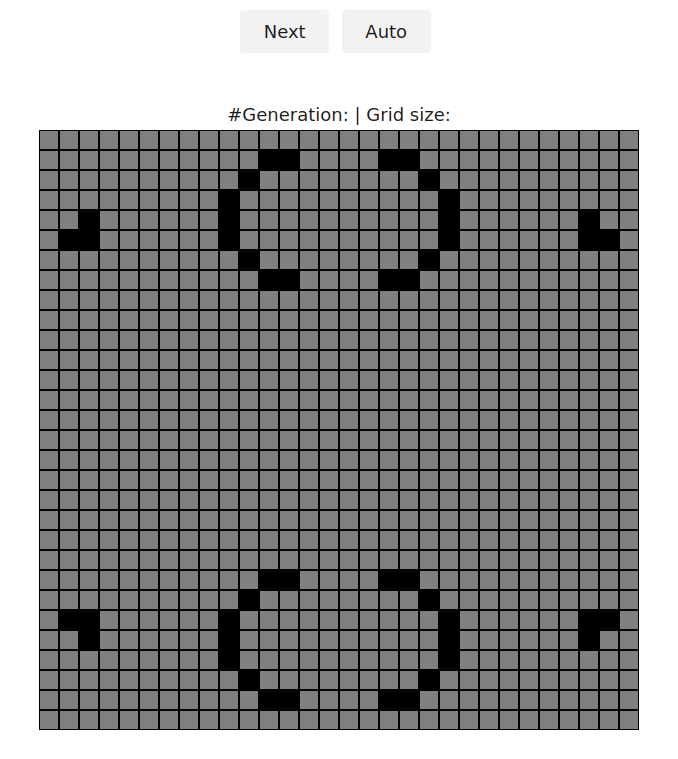

# TP javascript : bases du langages.
Un peu [d'aide](./aide.md).
#### Ex1 : fourmi de Langton
Une fourmi, assimilable à un petit automate, se promène sur une grille de points colorés; 
pour commencer, tous les points sont blancs.
- la fourmi est initialement placée au centre de la grille. Elle se déplace dans les quatre directions cardinales. Initialement, elle va vers l'est.
- A chaque pas, elle se déplace d'une case dans sa direction. Son parcours est dicté par les deux règles suivantes :
  - Si la case atteinte est noire, elle la repeint en blanc, et tourne de 90° à gauche.
  - Si la case est blanche, elle la repeint en noire, et tourne de 90° à droite.
- Elle continue son chemin en suivant ces règles.
<div align="center">

_Les 9 premiers pas de la fourmi_<br>

</div>

Vous disposez des [sources](./src/ex1)  que vous allez compléter. En particulier, il y a :
>- une classe **GridManager** qui crée dans le document une grille, avec des méthodes pour la gérer.
>- une classe **Ant** pour la fourmi.
>- une fonction **main** qui s'occupe de la simulation de l'automate.   

1. Complétez le code de la classe `Ant`.
2. Complétez le code de la fonction `computeNextPosition` qui fait avancer la fourmi.
3. Complétez la fonction `main` pour permettre de faire avancer la fourmi pas à pas en cliquant sur le bouton `next`
5. Faites afficher  le nombre de mouvements de la fourmi depuis le début de la simulation.
6. Ajoutez un bouton qui permet de faire avancer d'un coup la fourmi de 100 pas.
7. Ajoutez un bouton qui permet de recommencer la simulation.
8. Ajoutez un bouton qui permet d'afficher lors du clic une popin pour  renseigner la taille de la grille. 

>- Vous aurez besoin de la fonction [prompt](https://www.w3schools.com/jsref/met_win_prompt.asp).
>- La valeur que vous récupérer est un type `string`, il faut donc parser le type string en integer avec la fonction [parseInt()](https://developer.mozilla.org/fr/docs/Web/JavaScript/Reference/Objets_globaux/parseInt)
>- Vous allez réutiliser la fonction reset que vous avez écrite précédemment.
>- La grille est d'une taille minimum de 100.

<div align="center">

</div>


#### Ex2 : manipulation de tableaux et opérations `filter`, `map` et `reduce`
1. Complétez le [source](./src/ex2) `array.html`.
2. Complétez le [source](./src/ex2) `minmax.html`. 
3. La fonction `minmax` renvoie un tableau. Modifiez-là en renvoyant un objet 
   ```js
   { 'min' : ...,
     'max' : ...
   }
   ```
4. Utilisez la fonction `reduce` pour le calcul du minimum **et** du maximum.

#### Ex3 : le jeu de la vie

Le TP est une implantation en javasript du jeu de la vie. Il s'agit d'un automate cellulaire, dont les règles sont les suivantes : 
 - Une cellule morte possédant exactement trois voisines vivantes devient vivante. 
 - Une cellule vivante possédant deux ou trois voisines vivantes reste vivante, sinon elle meurt.

Une cellule est une unité de la grille (carrée). Un tour est appelé une génération.


>Pour plus d'informations, voir la page [Wikipédia](https://fr.wikipedia.org/wiki/Jeu_de_la_vie)

Vous disposez des [sources](./src/ex3) à compléter. En particulier, 

- la méthode `setInitialState` qui initialise la grille de départ. Le format en entrée est une chaîne
  contenant la liste des cellules vivantes.
	```js
	// exemple
	const INITIAL_STATE = '11,1;12,1;10,2;9,3;9,4;9,5;10,6;11,7;12,7;2,4;1,5;2,5;18,28;17,28;19,27;20,26;20,25;20,24;19,23;18,22;17,22;27,25;28,24;27,24;11,28;12,28;10,27;9,26;9,25;9,24;10,23;11,22;12,22;2,25;1,24;2,24;18,1;17,1;19,2;20,3;20,4;20,5;19,6;18,7;17,7;27,4;28,5;27,5'
	```
- la méthode `getNumberActiveNeighbourgCelles(x,y)` qui calcule le nombre de cellules vivantes voisines
  d'une cellule donnée.
- la fonction `computeNextGeneration` qui permet de calculer la génération suivante de cellules de la grille.

<div align="center">

</div>

- Ajoutez un bouton `reset` qui permet de recommencer le jeu.
- Ajoutez  bouton qui permet d'afficher lors du clic une popin. Vous allez pouvoir renseigner la taille de la grille.
- Affichez le numéro de la génération en cours, ainsi que la taille de la grille.


> Vous aurez besoin de la fonction [prompt](https://www.w3schools.com/jsref/met_win_prompt.asp).
