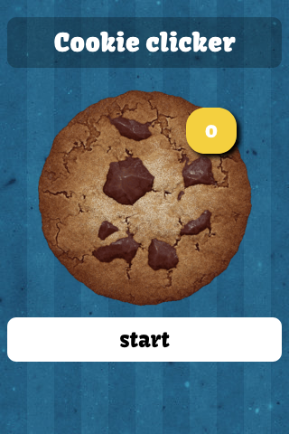
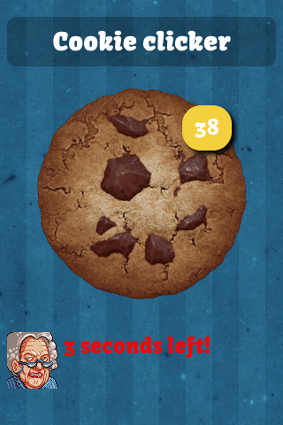
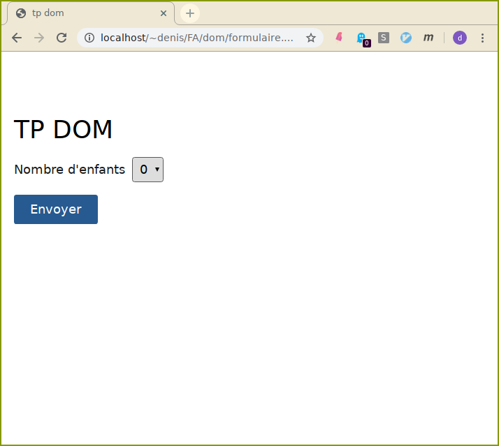
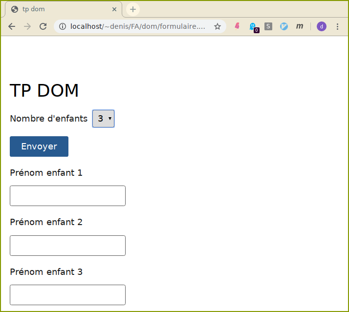
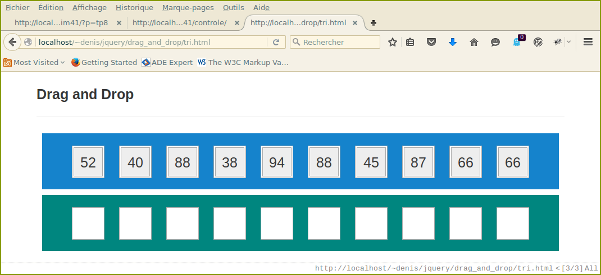
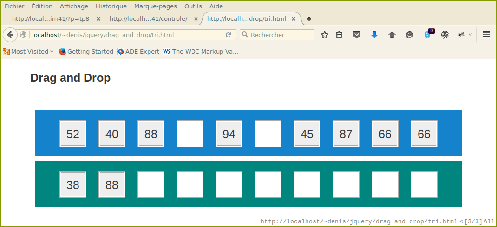
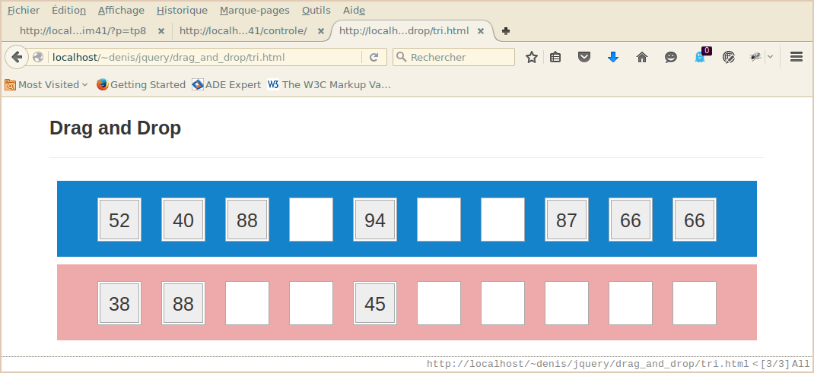

# TP javascript : DOM.
Un peu [d'aide](./aide.md).

#### Ex1 
On stocke dans un objet une liste de favoris :

```js
let liens = [
	{
		nom:"Google",
		url:"http://www.google.fr"
	},
	{
		nom:"Le Monde",
		url:"http://www.google.fr"
	},
	{
		nom:"L'Equipe",
		url:"http://www.lequipe.fr"
	}
];
```

Compléter le fichier `favoris.js` de manière à créer dans la page html la liste de liens
correspondant

   

Il vous faut créer dynamiquement les noeuds nécessaires avec l'api dom de javascript.

#### Ex2
Complétez le fichier javascript <code>contacts.js</code>, pour gérer une liste de contacts. L'interface 
comprend :

- une table pour les afficher, 
- un formulaire qui permet d'en ajouter dynamiquement,
- un bouton de sauvegarde des contacts courants.

De plus, lorsque l'on clique sur une ligne, celle-ci est supprimée de la table.

La  sauvegarde des contacts est réalisée en utilisant 
l'objet <a href="https://developer.mozilla.org/fr/docs/Web/API/Window/localStorage">localStorage</a>. Vous 
aurez sans-doute besoin de <code>JSON.stringify</code> et <code>JSON.parse</code>.

Essayez autant que possible  de respecter  le pattern MVC :

- un objet Model qui se charge de récupérer/sauver les données.
- un objet View qui permet d'afficher la table, de récuperer les données du formulaire, etc.
- un objet Controller.


Le contrôleur agira sur la vue par les méthodes que celle-ci offre. Le contrôleur sera notifé par la vue
des évènements nécessaires par un mécanisme de souscription comme celui-ci :

```js
let View ={
	...
	...
	suscribeSubmitForm(f){
		this.form.addEventListener("submit",(ev)=>{
			ev.preventDefault()
			let newCt = this.getContactFromForm()
			f(newCt) // f transmis par le controleur à la souscription
			this.form.reset()
		})
	},
	...
}

```


####  Ex3
Complétez le code du fichier <code>game.js</code> inclus dans <code>cookie.html</code> afin de concevoir un idle game consistant à cliquer sur un cookie le plus grand nombre de fois en 15 secondes.<br>

  

#### Ex4
Commplétez le fichier <code>form.js</code>. La page affiche une liste déroulante permettant de choisir un nombre d'enfants entre 0 et 5.

  

  Et ajoute au formulaire le nombre de champs texte permettant de saisir le prénom de chaque enfant,
  quand la sélection change.<br>

  

#### Ex5
 Le but est d'ajouter aux éléments html d'une page quelconque qui possède l'attribut 
 <code>data-tooltip</code> (avec un contenu) une bulle au survol de la souris  en affichant son contenu. 
 (la bulle suit le pointeur dans l'élément)

 <br>    


 - Ceci devra être réaliser uniquement par l'inclusion dans la partie <code>head</code> d'un fichier javascript.
 - Proposer et implanter cette fonctionnalité.


#### Ex6    **Glisser/Déposer** 
Le but est de trier un tableau d'entiers, par ordre croissant, par glisser/déposer (drag and drop). <br>





Travail à faire
  - La génération des entiers dans les divisions "draggable".
  - La sensibilisation aux   événements <code>dragstart, drop, dragover</code>. Vous trouverez toute l'information utilie sur l'interface drag and drog d'html5 <a target="_blank" href="http://www.w3schools.com/html/html5_draganddrop.asp">ici</a>. 
  - Dans la zone correspondante au tableau trié, le fond change de couleur suivant que les entiers déjà déposés sont triés correctement ou non.
   
Pour gérer les classes css d'un noeud, vous pouvez utilisez la propriété <a href="https://developer.mozilla.org/fr/docs/Web/API/Element/classList" target="_blank">classList</a>.

